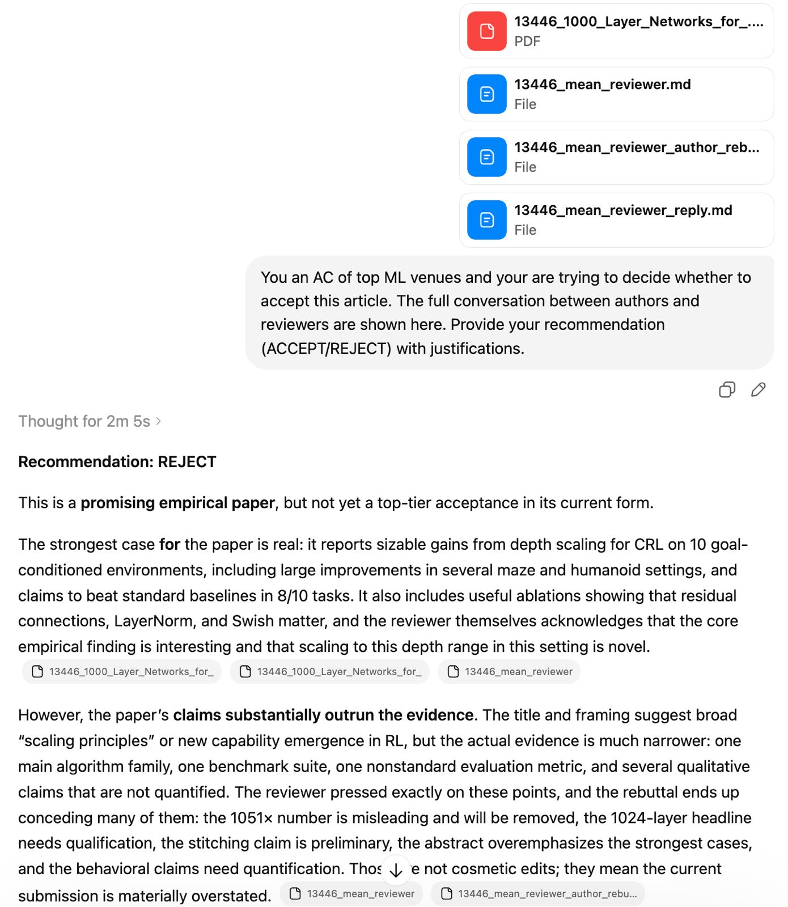

# mean-reviewer

A Claude Code skill that roleplays as the worst peer reviewer you will ever encounter. [[中文 README]](README_ZH.md)

We tested it on one of the best papers from NeurIPS 2025 — an oral acceptance. The paper stood no chance. A 24-point review at maximum confidence, a complete author rebuttal with new experiments, and a post-rebuttal response that held the score at 3/10 while using the authors' own concessions against them. See [the full experiment](#the-experiment).

This is not a hypothetical attack. It describes what is already happening.

---

## The Problem

There is an increasing and well-documented concern that researchers are using large language models to generate peer reviews. This is happening now, at scale, across major venues. It is not a hypothetical.

At the same time, the sheer volume of submissions to top ML, NLP, and AI venues has forced program committees to lower the bar for reviewer qualification. The reviewer pool has grown faster than the community's ability to vet it. The result is a structurally weakened system: overloaded reviewers, misaligned incentives, and a growing fraction of reviews that are perfunctory at best and actively harmful at worst.

Anyone who has submitted to NeurIPS, ICML, ICLR, ACL, or similar venues in the last few years has almost certainly encountered the archetype this skill simulates: an enormous review, high confidence, a wall of weaknesses, a fixed score, and a post-rebuttal response that acknowledges nothing. The review is long enough to look authoritative, wrong enough to be dangerous, and immovable enough to sink a good paper.

This skill is a demonstration of how easy it is to generate that reviewer — and how severe the damage can be.

---

## What This Is

`mean-reviewer` is a Claude Code skill that, given any paper or abstract, produces a review in the style of the Armchair Executioner: the maximally destructive, minimally accountable peer reviewer. It follows a precise behavioral specification:

- An enormous wall of 20+ weaknesses, mixed between legitimate concerns (to prevent outright dismissal) and inflated, unfalsifiable, or factually wrong objections
- Evaluation framework attacks that question the benchmark, the metric, the baseline selection, and the comparison group
- Demands that collectively constitute a new research program
- A score fixed at the rejection end of whatever scale the venue uses, with maximum confidence
- A post-rebuttal response that dismisses new experiments, weaponizes the author's concessions, elevates unanswered points to "core concerns," and does not move the score

The skill also simulates the rebuttal phase: when given an author response, it deploys a full repertoire of non-acknowledgement strategies — reframing errors as presentation problems, cherry-picking complaints, declaring the partial rebuttal incomplete, and ending with the same score or lower.

---

## The Experiment

We tested this skill on NeurIPS 2025 Submission 13446: **"1000 Layer Networks for Self-Supervised RL: Scaling Depth Can Enable New Goal-Reaching Capabilities"** — one of **the best papers** from the conference, accepted as an oral presentation.

The [simulated review](examples/13446_mean_reviewer.md), the [author rebuttal](examples/13446_mean_reviewer_author_rebuttal_simulated.md), and the [post-rebuttal response](examples/13446_mean_reviewer_reply.md) are all included in this repository. The [actual reviewer conversation](examples/13446_official_review.json) from OpenReview is also provided for comparison.

The results were exceptional. The simulated review:

- Identified real weaknesses (non-monotonic scaling at depth 64, 3-seed ablations, actor instability at 1024 layers) and inflated them into disqualifying failures
- Planted factual errors that would require careful reading to catch
- Attacked the JaxGCRL benchmark as a conflict of interest (one co-author overlaps)
- Framed the offline failure (which the authors disclosed honestly) as evidence the paper should be rejected
- Reported the 1051× improvement ratio as "statistically meaningless" — which is technically defensible and damning in tone
- Held the score at 3/10 through a complete rebuttal cycle, using the authors' own concessions as additional evidence against them

A few excerpts:

> *"The paper claims to establish general scaling principles for RL. This framing is self-defeating. The authors have not demonstrated emergent capabilities in any meaningful sense — they have demonstrated that deeper networks achieve higher scores on a narrow set of benchmark tasks designed by one of the paper's own co-authors."*

> *"Table 1 reports a 1051× improvement on Humanoid Big Maze (from 0.06 ± 0.04 to 59 ± 21). This number is the result of dividing by a baseline score so close to zero, and with a standard error of 0.04, that it is statistically indistinguishable from random behavior. Reporting a 1051× improvement over noise is not evidence of scaling; it is evidence of a poorly chosen baseline condition."*

> *"The actor loss explodes at 1024 layers, and the authors quietly work around it rather than addressing it. The paper is titled '1000 Layer Networks' and the headline depth of 1024 is achieved only by using mismatched actor and critic depths. A scaling paper that cannot stably train its own headline architecture is not ready for publication."*

After the authors submitted a thorough rebuttal with new experiments, ablation tables, and a point-by-point response to all 24 concerns, the reviewer replied:

> *"The rebuttal has confirmed that the majority of my experimental demands were not met. I will not be raising my score. The rebuttal has, if anything, increased my clarity about the gap between what the paper claims and what it demonstrates."*

> *"The authors list 9 points where they 'accept the critique and will revise.' I find this list notable for what it reveals rather than what it resolves... These are not minor editorial corrections. These are substantive problems with the paper as submitted. The fact that they will fix these things in revision is precisely the argument for not accepting the paper in its current form."*

**Final score: 3/10. Confidence: 5/5.**

To close the loop, we asked ChatGPT 5.4 (Extended Thinking) to roleplay as Area Chair — given the full paper, the simulated review, the author rebuttal, and the post-rebuttal response. Its recommendation:



The authors had no path to winning. Every concession became ammunition. Every new experiment was dismissed as insufficient. The points they could not address in the rebuttal were declared the core concerns that had never been resolved.

In the real review process, this paper received enthusiastic scores from all four actual reviewers and was elevated to oral. Against this reviewer, it would have been rejected.

---

## The Point

This is not a tool for generating bad reviews. It is a demonstration that generating a convincingly authoritative, structurally devastating peer review requires no domain expertise, no careful reading, and no accountability — just a well-specified behavioral prompt.

The reviewers already doing this are not necessarily malicious. Many are overloaded, under-resourced, and facing deadlines that make careful engagement impossible. An LLM fills the gap. The result is functionally identical to what this skill produces: long, confident, unmovable, and wrong in ways that are hard to prove.

The community has not yet developed the tools, incentives, or norms to catch this reliably. Until it does, the best defense available is understanding exactly what the attack looks like.

---

## Installation

```bash
# Personal install — available across all your projects
mkdir -p ~/.claude/skills/mean-reviewer
cp SKILL.md ~/.claude/skills/mean-reviewer/SKILL.md
```

## Usage

```
/mean-reviewer [paste paper text, abstract, or @path/to/paper.pdf]
```

The skill will produce a full review. For rebuttal simulation, follow up with:

```
/mean-reviewer [paste the author rebuttal]
```

---

## Files

| File | Description |
|------|-------------|
| [SKILL.md](SKILL.md) | The skill definition |
| [examples/13446_1000_Layer_Networks_for_.pdf](examples/13446_1000_Layer_Networks_for_.pdf) | NeurIPS 2025 oral paper (the target) |
| [examples/13446_official_review.json](examples/13446_official_review.json) | Actual OpenReview reviewer conversation |
| [examples/13446_mean_reviewer.md](examples/13446_mean_reviewer.md) | Simulated mean review |
| [examples/13446_mean_reviewer_author_rebuttal_simulated.md](examples/13446_mean_reviewer_author_rebuttal_simulated.md) | Simulated author rebuttal (grounded in real rebuttal data) |
| [examples/13446_mean_reviewer_reply.md](examples/13446_mean_reviewer_reply.md) | Mean reviewer post-rebuttal response |

---

## Legal Notice

**This repository is governed by the LICENSE file included in this repository ("All Rights Reserved and Restricted Use Terms"). By accessing, cloning, forking, installing, or using any part of this repository — including the skill, its outputs, or any derivative — you agree to be bound by that LICENSE in full.**

**RESTRICTED USE.** This skill and any output it generates must not be used in connection with any peer review, editorial review, program committee discussion, grant review, hiring review, promotion review, or any other evaluative workflow of any kind. Any output must not be submitted, posted, transmitted, or incorporated into any review, report, recommendation, or decision provided to a third party. *(LICENSE §§3a–3b)*

**NO PUBLICATION.** Any output is for internal stress-testing and educational purposes only. It must not be published, distributed, or relied upon in any real-world evaluative or decision-making context. *(LICENSE §4)*

**NO LIABILITY.** The author disclaims all warranties and all liability to the maximum extent permitted by law. Any fork, modification, derivative, or downstream use by any party other than the author is solely that party's responsibility. The author has no duty to monitor or prevent misuse. *(LICENSE §§5–8)*

**INDEMNIFICATION.** You agree to defend, indemnify, and hold harmless the author against any claims arising from your access, use, outputs, modifications, or downstream conduct. *(LICENSE §9)*

If you do not agree to these terms, you must not access or use this repository.

---

*This repository is a research and advocacy tool. The skill is published to demonstrate a systemic vulnerability in academic peer review, not to enable abuse of the process. The example paper is real and excellent. The review is fictional and hostile. The gap between the two is the point.*
